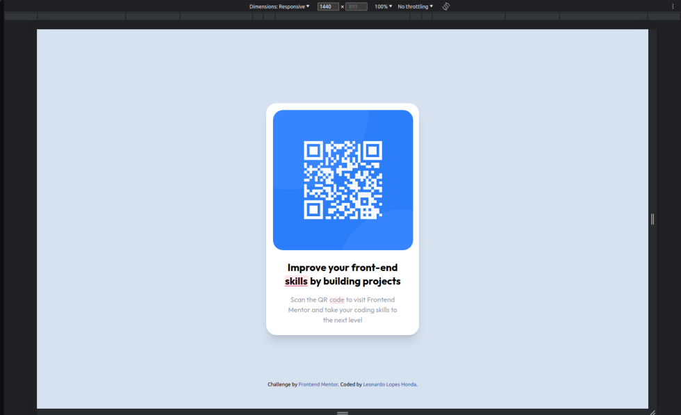
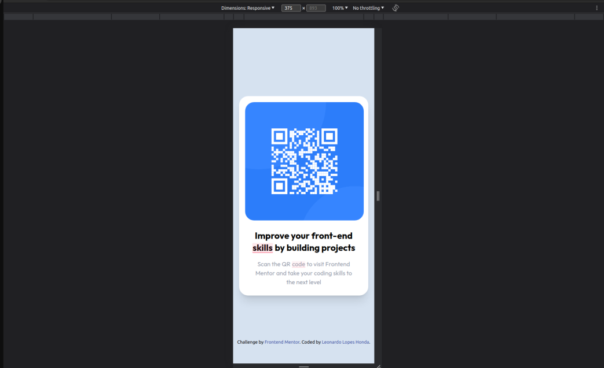

# Frontend Mentor - QR code component solution

This is a solution to the [QR code component challenge on Frontend Mentor](https://www.frontendmentor.io/challenges/qr-code-component-iux_sIO_H). Frontend Mentor challenges help you improve your coding skills by building realistic projects. 

## Table of contents

- [Overview](#overview)
  - [Screenshot](#screenshot)
  - [Links](#links)
- [My process](#my-process)
  - [Built with](#built-with)
  - [What I learned](#what-i-learned)
  - [Continued development](#continued-development)
  - [Useful resources](#useful-resources)
- [Author](#author)

## Overview

### Screenshot




### Links

- Solution URL: [GitHub](https://github.com/LeonardoLopesHonda/QR-Code_component)
- Live Site URL: [Live-preview](https://leonardolopeshonda.github.io/QR-Code_component-tailwindcss/)

## My process

I've started with the tailwind basic configs, then HTML tags, then started adding the image url and adjusting the card and image sizes, then I started styling fonts, margins, padding and colors, then I created a breakpoint to the card width using 'lg:' pseudo-class and finally I started editing the README.md.

### Built with

- Semantic HTML5 markup
- CSS custom properties
- Flexbox
- Mobile-first workflow
- Tailwindcss

### What I learned

I've recap how to add custom variables in the tailwindcss.

```
module.exports = {
  content: ["./**/*.{html,js}"],
  theme: {
    extend: {
      colors: {
        'white-hsl': 'hsl(0, 0%, 100%)',
        'light-gray': 'hsl(212, 45%, 89%)',
        'grayish-blue': 'hsl(220, 15%, 55%)',
        'dark-blue': 'hsl(218, 44%, 22%)',
        'contrast': 'hsl(228, 45%, 44%)',
      },
      fontFamily: {
        outfit: ['Outfit', 'sans-serif'],
      }
    },
  },
  plugins: [],
}
```

### Continued development

I want to refactor this project with a sass or less or a framework and master responsiveness layouts with any tool that I choose.

### Useful resources

- [Tailwindcss docs](https://tailwindcss.com/docs/installation) - This helped me recap the functions that I needed

## Author

- Frontend Mentor - [@LeonardoLopesHonda](https://www.frontendmentor.io/profile/LeonardoLopesHonda)
- LinkedIn - [Leonardo Honda](https://www.linkedin.com/in/leonardo-honda-9a3383248/)